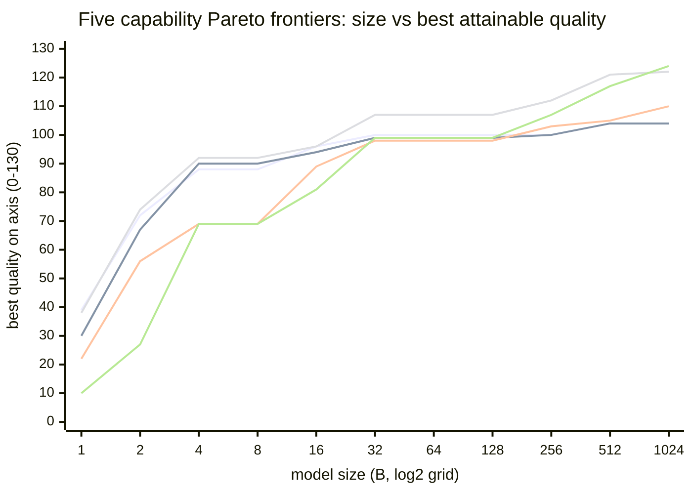
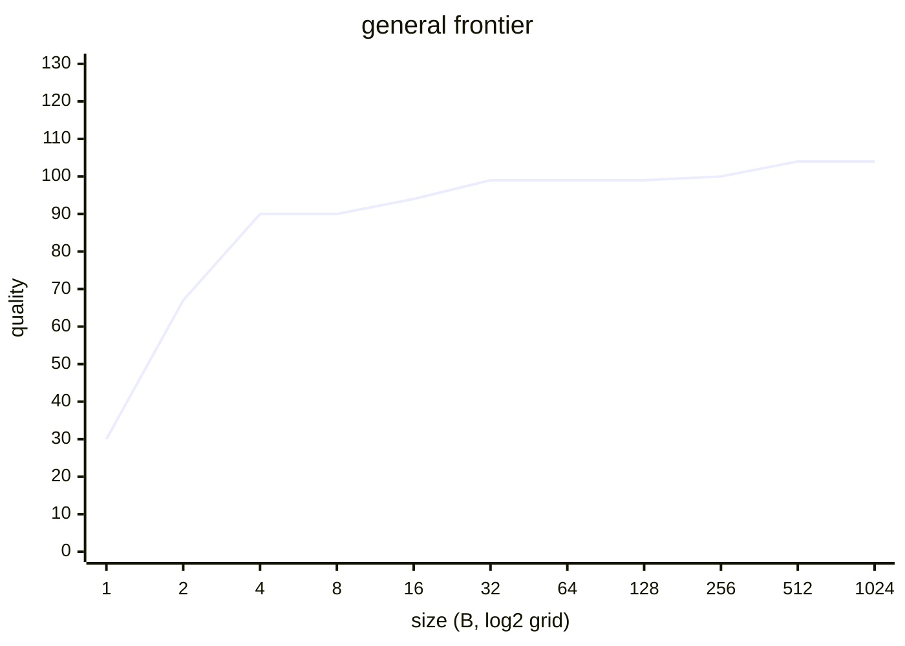
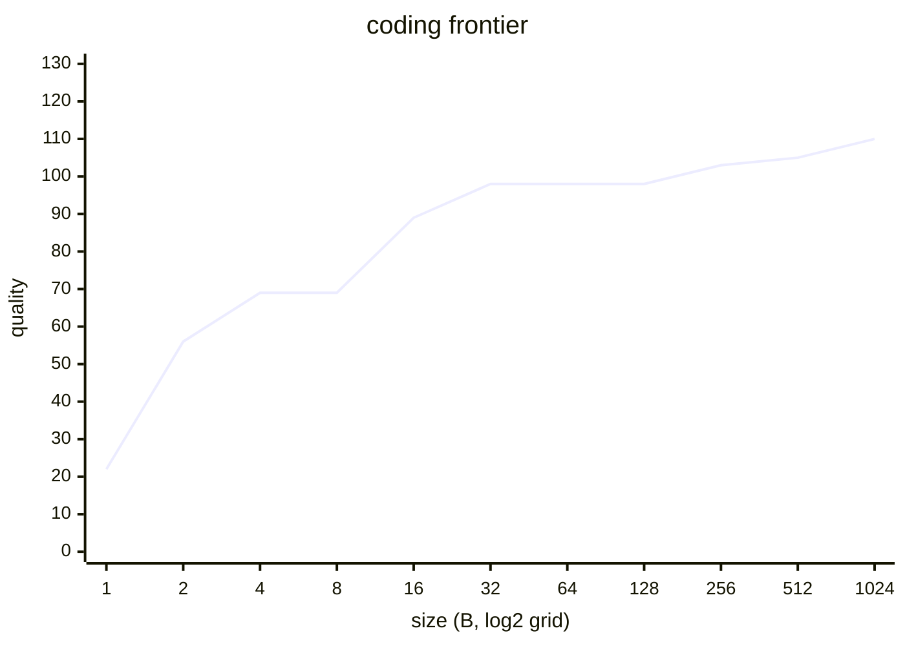
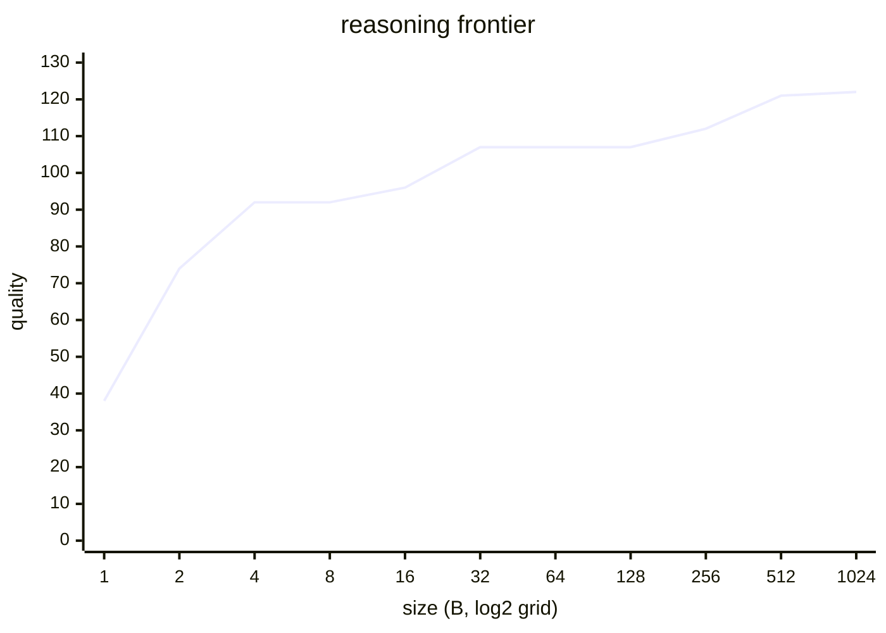
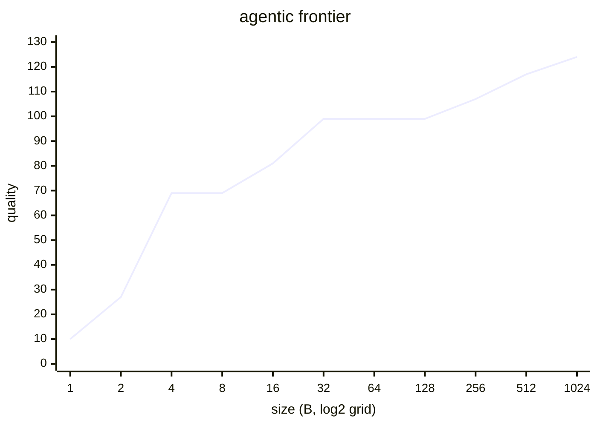

# Roster Pareto Analysis

How the candidate pool spreads across **size** (parameters) and **capability** (the 5
`qualityBy` axes), and the **frontier-tolerance gate** that turns it into the active roster.

The roster is built in two stages: `scripts/gen-roster.mjs` selects a **~98-model candidate
pool** (30 hand-authored + 68 per-size-bucket Pareto picks), then a **10% frontier-tolerance
gate** (`withinFrontierTolerance`, `src/sim/calibrate.ts`) trims it to the **42 active
checkpoints** the player actually owns/deploys. The charts below are computed from the pool;
§3–§4 cover the gate and the active roster.

All numbers are computed from the *actual loaded roster* — `MODEL_LIST`'s `qualityBy`
(calibrated by `src/sim/calibrate.ts`) and `paramsTotalB` — not estimates. A "frontier" is
the **(minimize size, maximize quality)** upper envelope: at each size, the best quality
attainable on that axis. Regenerate after any roster/calibration change.

---

## 1. The five capability Pareto frontiers

Each axis has its own size↔quality frontier. Evaluated on a log₂ size grid (1→1024 B),
`frontier(size) = max quality over all models with paramsTotalB ≤ size` (monotone).

`xychart-beta` has no legend; the five `line` series, in declaration order, are:

| # | axis | ≤1B | ≤1024B | shape |
|---|------|----:|-------:|-------|
| 1 | **chat** | 39 | 104 | flattest — saturates by 27B (q100) |
| 2 | **general** | 30 | 104 | tracks chat closely (shared GPQA/IFBench blend) |
| 3 | **coding** | 22 | 110 | lowest start; top pulled up by GLM-5.2 |
| 4 | **reasoning** | 38 | 122 | jumps early (27B already q107) |
| 5 | **agentic** | 10 | **124** | lowest start, longest climb, highest peak — the agent wall |

### Per-axis frontier curves + the models that sit on them

**chat** — Qwen3 0.6B (28) → Gemma 4 E2B (72) → Qwen3.5 4B (88) → Qwen3.5 27B (100) → MiniMax-M3 428B (104)

**general** — Qwen3.5 2B (67) → Qwen3.5 4B (90) → Qwen3.5 27B (99) → Qwen3.5-397B (101) → MiniMax-M3 (104)

**coding** — Gemma 4 E2B (56) → Qwen3.5 9B (84) → Gemma 4 31B (98) → MiniMax-M3 (105) → GLM-5.2 753B (110)

**reasoning** — Qwen3.5 2B (74) → Qwen3.5 4B (92) → Qwen3.5 27B (107) → DeepSeek V4 Flash 284B (114) → GLM-5.2 (122)

**agentic** — Qwen3.5 4B (69) → Qwen3.6-27B (96) → Gemma 4 31B (99) → MiniMax-M2.7 230B (107) → GLM-5.2 753B (124)

---

## 2. Per-size-bucket capability ceilings

The best quality on each axis **within** each of the six size buckets the selector uses
(`scripts/gen-roster.mjs`). Bucket populations: ≤4B 20 · 4–15B 23 · 15–40B 20 · 40–120B 14 · 120–400B 8 · >400B 13.

| bucket | chat | general | coding | reasoning | agentic |
|--------|-----:|--------:|-------:|----------:|--------:|
| ≤4B | 88 | 90 | 69 | 92 | 69 |
| 4–15B | 96 | 94 | 89 | 96 | 81 |
| **15–40B** | **100** | **99** | **98** | **107** | **99** |
| 40–120B | 97 | 95 | 90 | 101 | 87 |
| 120–400B | 101 | 101 | 103 | 114 | 109 |
| >400B | 104 | 104 | 110 | 122 | 124 |

**Capability compression:** the **15–40B** tier beats the **40–120B** tier on *every*
axis (reasoning 107 vs 101, coding 98 vs 90, agentic 99 vs 87). A single 27B class model
(Qwen3.5-27B / Qwen3.6-27B) outscores everything up to 120B — so the frontier is *flat*
from ~32B to ~120B. Stacking parameters in that band buys nothing; only the >120B MoE
frontier (MiniMax-M3, GLM-5.2) moves the ceiling.

---

## 3. Hand-30 frontier-coverage review

The 30 hand-authored checkpoints were curated *before* the 68 Pareto-selected ones were
added. Measured against the full 98-model population:

- **4 are Pareto-optimal** (nothing dominates them).
- **1 is frontier-adjacent** (Qwen3.6-27B, on the agentic frontier but tied/edged by a
  same-size model).
- **25 are Pareto-dominated** — and 26 are beaten by a *strictly smaller* model on all 5 axes.

| model | size | on frontier(s) | Pareto-opt | note |
|-------|-----:|----------------|:----------:|------|
| Llama 3.2 1B | 1.2B | — | ✗ | edge starter |
| Qwen3-4B-Instruct-2507 | 4B | — | ✗ | |
| Llama 3.1 8B | 8B | — | ✗ | **DEFAULT_MODEL_ID / starter** |
| Qwen3 8B | 8.2B | — | ✗ | redundant w/ Qwen3-4B |
| Nemotron Nano 9B v2 | 9B | — | ✗ | |
| Gemma 3 12B | 12B | — | ✗ | superseded by Gemma 4 |
| Phi-4 14B | 14B | — | ✗ | |
| gpt-oss 20B | 21B | — | ✗ | |
| Mistral Small 3.2 24B | 24B | — | ✗ | |
| Devstral Small 24B | 24B | — | ✗ | |
| Gemma 3 27B | 27B | — | ✗ | dominated by 17 models |
| **Qwen3.6-27B** | 27B | agentic | ~ | frontier-adjacent |
| Nemotron 3 Nano 30B-A3B | 30B | — | ✗ | |
| Qwen3 30B-A3B | 30B | — | ✗ | |
| Qwen3-Coder-30B-A3B | 30B | — | ✗ | |
| Qwen3 32B | 33B | — | ✗ | |
| Llama 3.3 70B | 70B | — | ✗ | iconic |
| Qwen3-Next-80B-A3B | 80B | — | ✗ | |
| GLM-4.5-Air | 106B | — | ✗ | |
| gpt-oss 120B | 117B | — | ✗ | **test ref (GRPO base)** |
| Nemotron-3-Super-120B-A12B | 120B | — | ✗ | |
| **Qwen3.5-122B-A10B** | 122B | — | ✓ | balanced non-dominated |
| Qwen3 235B-A22B | 235B | — | ✗ | **test ref** |
| **Qwen3.5-397B-A17B** | 397B | general, agentic | ✓ | |
| **MiniMax-M3** | 428B | all 5 | ✓ | ⭐ on every frontier |
| Nemotron 3 Ultra 550B | 550B | — | ✗ | flagship name |
| DeepSeek-V3.1 | 671B | — | ✗ | **test ref**; iconic |
| **GLM-5.2** | 753B | coding, reasoning, agentic | ✓ | ⭐ |
| Kimi K2 Thinking | 1000B | — | ✗ | **test ref**; iconic |
| DeepSeek-V4-Pro | 1600B | — | ✗ | flagship name |

### The domination is real, not a calibration artifact

Spot-checked against raw Artificial Analysis benchmarks: Qwen3.6-27B genuinely beats
DeepSeek-V3.1 (671B) on **every** input — GPQA-D 84.2 vs 77.9, IFBench 67.6 vs 41.5,
LCR 68.7 vs 53.3, SciCode 39.8 vs 39.1, TB-Hard 34.8 vs 25, HLE 21.6 vs 13. Likewise
Qwen3.5-122B (GPQA 85.7 / IFBench 75.7) really edges Kimi K2 and Qwen3-235B. So a
dominated hand model is dominated *for real* — this is the 2024→2026 capability
compression, the same arc the campaign is built around (a 2023 checkpoint *should* be
obsolete by the 2026 frontier).

"Poor Pareto performance" here does **not** mean the 30 were badly chosen — it means the
roster faithfully encodes real obsolescence (a 2024 checkpoint *should* be dominated by the
2026 frontier). That is exactly what the gate in §4 prunes.

---

## 4. The active roster — the 10% frontier-tolerance gate

A strict Pareto front would collapse the 98-model pool to ~20 models (mostly low-confidence
generated, an empty 40–120B band, every recognizable name gone). Instead the active roster
keeps a checkpoint iff, **on at least one capability axis, its quality is within 10% of the
frontier at its size** (`withinFrontierTolerance`, `src/sim/calibrate.ts`,
`ROSTER_FRONTIER_TOLERANCE = 0.1`). A model is dropped only if it trails the frontier by
**more than 10% on every axis** — strictly beaten by something no bigger, on all five lanes.

This trims the **~98 candidate pool → 42 active checkpoints** (14 hand-authored + 28
Pareto-selected), spanning every size tier:

| bucket | active | bucket | active |
|--------|-------:|--------|-------:|
| ≤4B | 12 | 40–120B | 3 |
| 4–15B | 6 | 120–400B | 6 |
| 15–40B | 10 | >400B | 5 |

The gate drops the 56 sub-frontier candidates — overwhelmingly older recognizable models
(Llama 3.x, Phi-4, Mistral/Devstral, Gemma 3, DeepSeek-V3.1) that the 2026 frontier beats on
every axis by >10%. This is a deliberate "lean Pareto roster" choice: every deployable
checkpoint is a rational pick on some lane at its size. It drops three real developers
entirely (Meta, Microsoft, Mistral); their current models are genuinely >10% behind. The
default starter is recomputed as the smallest dense, non-reasoning kept model
(`DEFAULT_MODEL_ID`). See [REALISM-MODELS.md](REALISM-MODELS.md) §3 for the build pipeline.
